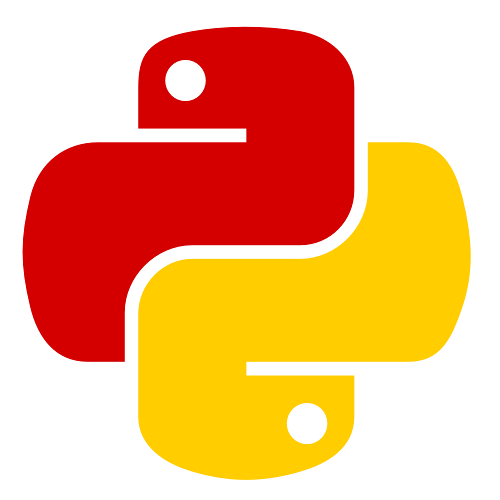

.. Memoria PyConES 2015 documentation master file, created by
   sphinx-quickstart on Mon Dec 21 20:15:04 2015.
   You can adapt this file completely to your liking, but it should at least
   contain the root `toctree` directive.

Memoria PyConES 2015
====================

Esta memoria documenta el proceso de organización de la tercera edición de la Python Conference Spain (PyConES),
celebrada del 20 al 22 de noviembre de 2015 (http://2015.es.pycon.org/).

El objetivo es dejar constancia del desarrollo, comentar los aciertos y errores cometidos y servir de referencia a los
organizadores de futuras ediciones.

Contenidos
----------

.. toctree::
   :maxdepth: 2

   introduccion
   organizacion
